<p align="center">
  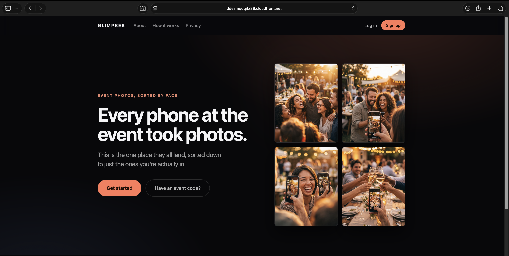
</p>

<h1 align="center">Glimpses</h1>
<p align="center"><b>A Serverless Image Retrieval System.</b></p>
<p align="center">Drop in all the photos. It shows you the ones you're in.</p>

<p align="center">
  <a href="#product-walkthrough">Product walkthrough</a> ·
  <a href="#core-features">Features</a> ·
  <a href="#architecture">Architecture</a> ·
  <a href="#running-it-yourself">Deploy it yourself</a>
</p>

---

### Table of contents

| Sr No. | Title |
|---|---|
| 1 | [What it does](#what-it-does) |
| 2 | [Product walkthrough](#product-walkthrough) |
| 3 | [Core features](#core-features) |
| 4 | [Who it's for](#whos-it-for) |
| 5 | [Tech stack](#tech-stack) |
| 6 | [Architecture](#architecture) |
| 7 | [Project structure](#project-structure) |
| 8 | [The Lambdas](#the-lambdas) |
| 9 | [The database (DynamoDB)](#the-database-dynamodb) |
| 10 | [The ingestion pipeline (Step Functions)](#the-ingestion-pipeline-step-functions) |
| 11 | [Triggers and edge cases](#triggers-and-edge-cases) |
| 12 | [The knowledge graph (`graphify`)](#the-knowledge-graph-graphify) |
| 13 | [Cost: built entirely on the AWS Free Tier](#cost-built-entirely-on-the-aws-free-tier) |
| 14 | [Scaling past the defaults](#scaling-past-the-defaults) |
| 15 | [Running it yourself](#running-it-yourself) |
| 16 | [CI/CD (Jenkins)](#cicd-jenkins) |
| 17 | [License](#license) |

---

## What it does

An organizer creates an event and shares a join code or QR code. Guests join the event and upload their photos, either individually or all at once as a ZIP directly from their camera roll. Everyone in the event can then browse the shared gallery instantly.

Every guest also gets a **"Photos of me"** tab, built automatically. Glimpses compares each guest's selfie against every face detected in every uploaded photo, so nobody has to scroll through hundreds of photos looking for the ones they're actually in. No manual tagging, and no "can someone send me the ones with me in them" group chat message.

It's built entirely on serverless AWS: no servers to provision or patch, nothing idling between events, and it scales comfortably from a 10 person dinner to an 800 photo wedding without anyone touching a config file.

<p align="center">
  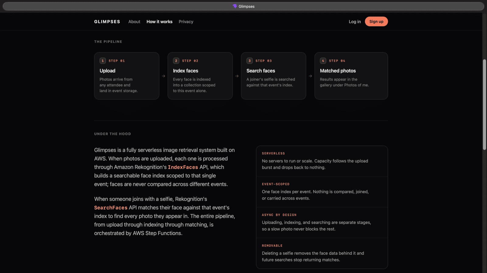
</p>

---

## Product walkthrough

A guest and organizer's path through Glimpses, start to finish.

**Getting in.** Sign up once, then log in for every event after that — the same account works across all of them.

<p align="center">
  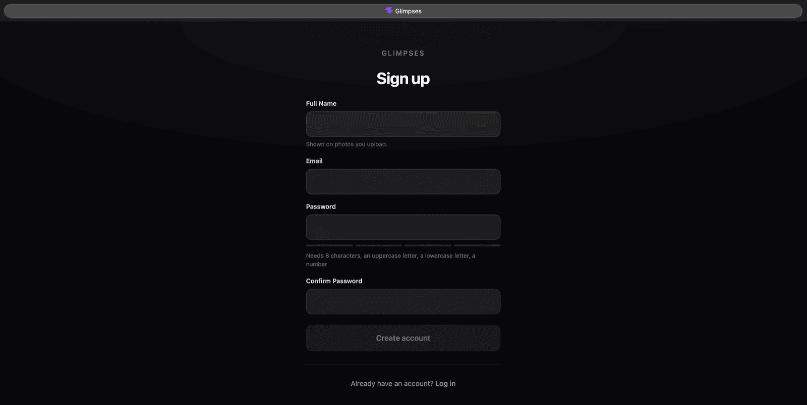
  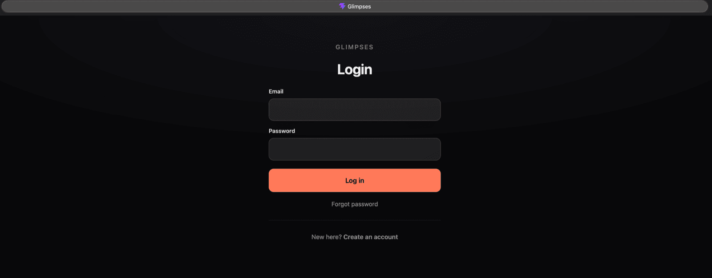
</p>

**Sharing and joining an event.** The organizer hands out a join code or QR code; guests scan or enter it to request access. On approval-required events, they sit in the lobby until the organizer admits them.

<p align="center">
  
  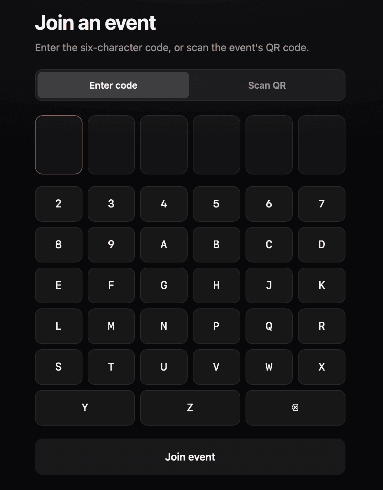
  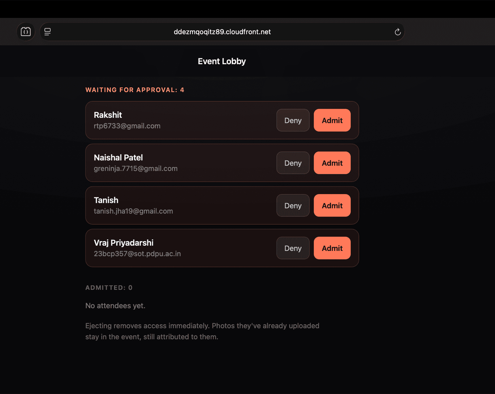
</p>

**My events.** Every event an organizer has created, in one dashboard.

<p align="center">
  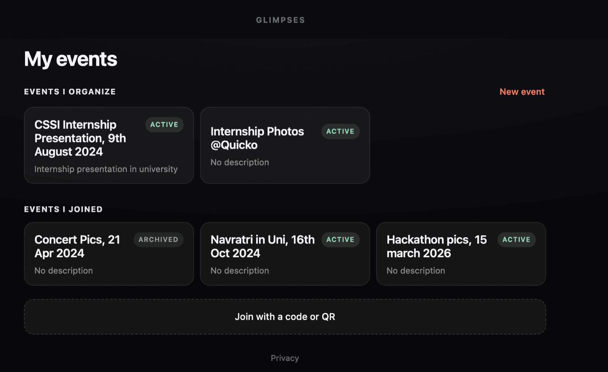
</p>

**Event settings, analytics, and downloads.** Who can join, who can upload, and the archive/delete lifecycle, next to live stats for the event and one-click ZIP downloads for a batch of photos.

<p align="center">
  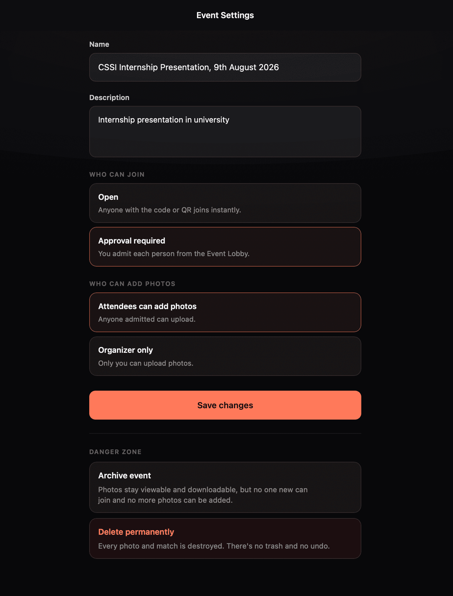
  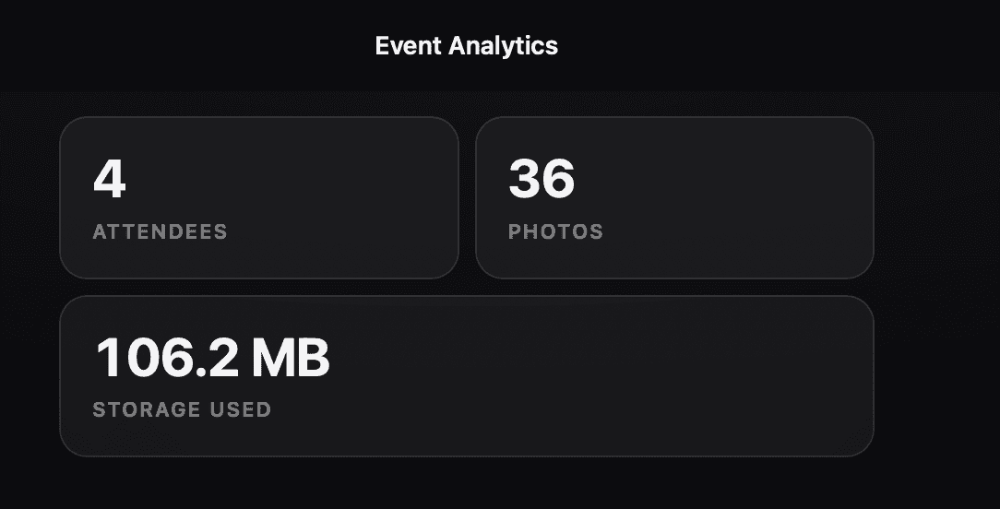
  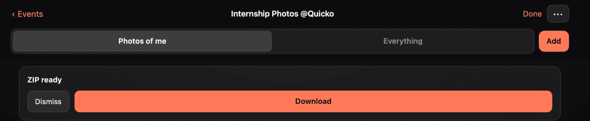
</p>

**Privacy.** Guest-level controls over who can see what.

<p align="center">
  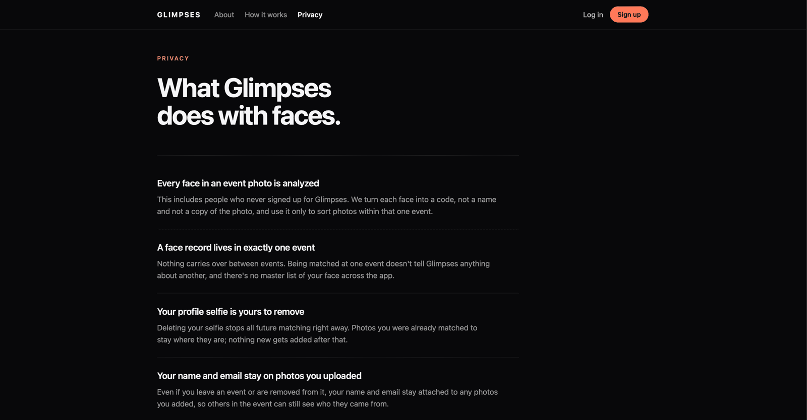
</p>

**Uploading photos.** Upload one at a time or in bulk, with confirmation of what made it in.

<p align="center">
  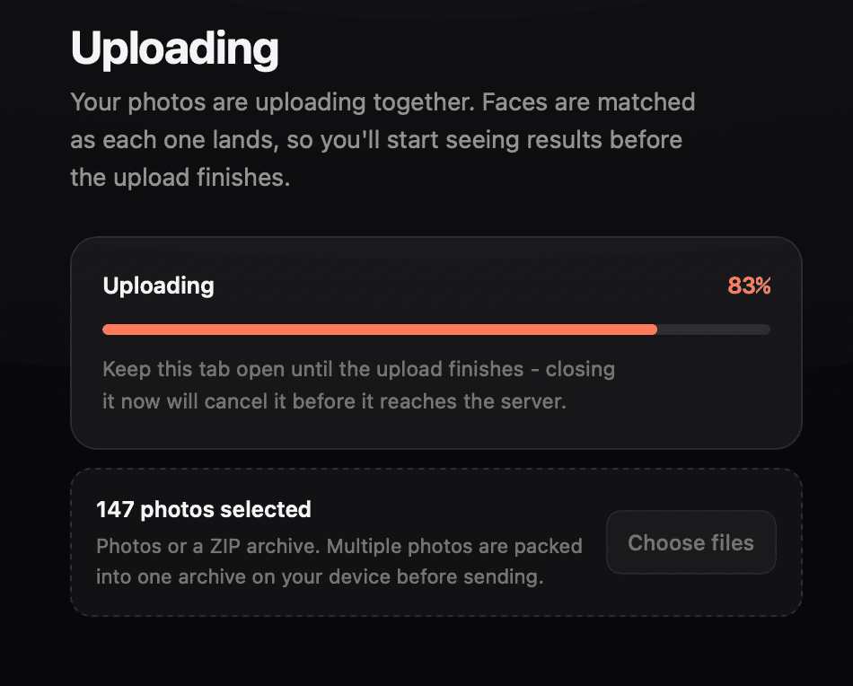
  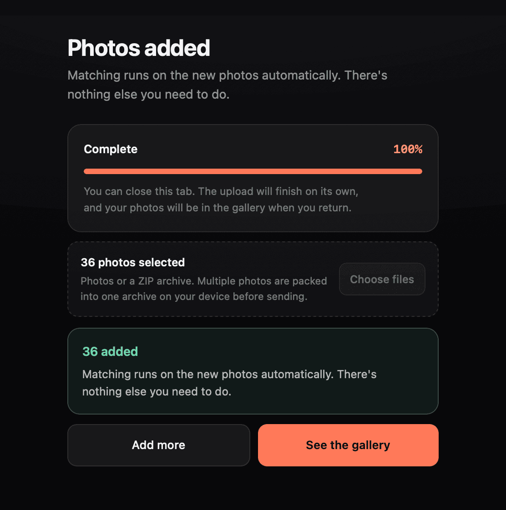
</p>

**Everything, and Photos of me.** Every uploaded photo lands in the shared gallery immediately, while "Photos of me" is built automatically by matching faces against each guest's selfie.

<p align="center">
  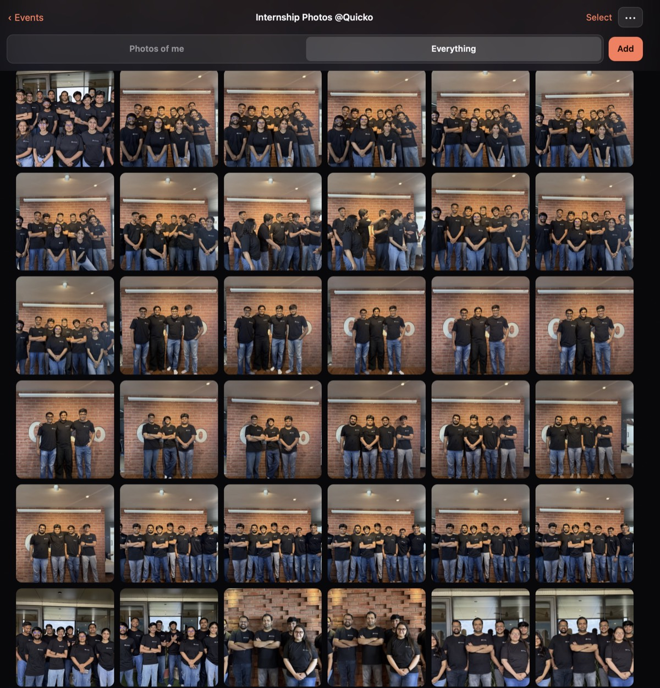
  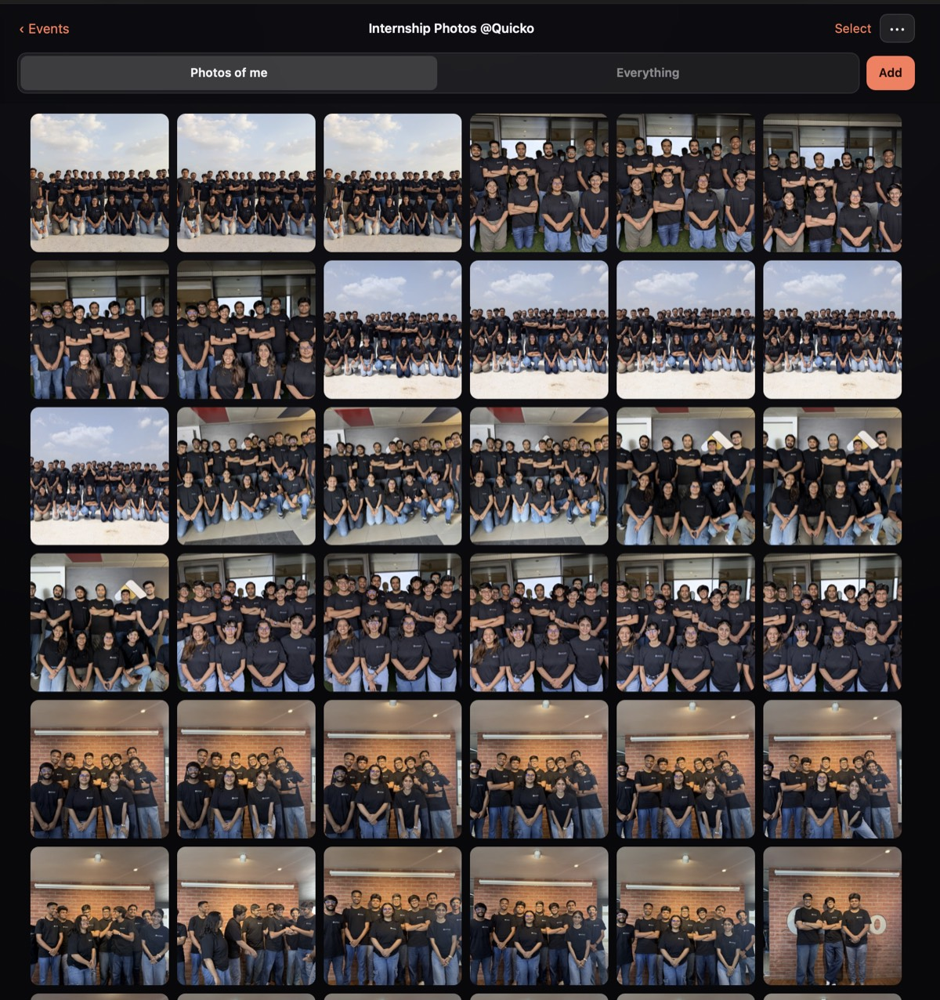
</p>

**Profile.** Manage your own selfie and account details anytime.

<p align="center">
  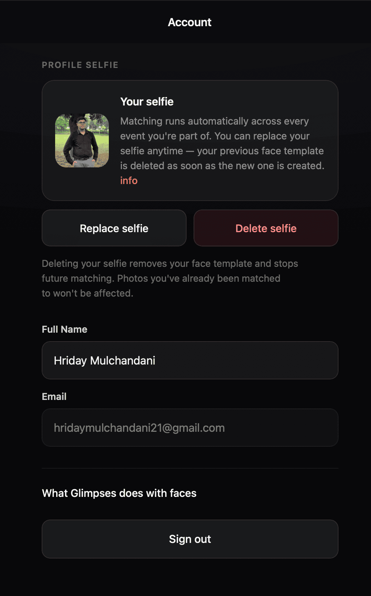
</p>

---

## Core features

- **Event creation and join flow.** Organizers create events with a join code or QR code. Guests join instantly on open events, or wait for organizer approval on approval-required events.
- **Bulk photo upload.** Upload photos one by one, or bundle hundreds into a zip and let the pipeline sort it out. Junk files macOS and Windows quietly add to every zip (`__MACOSX/`, `._*`, `.DS_Store`, `Thumbs.db`, `ehthumbs.db`, `desktop.ini`) are filtered out automatically, so they never show up as confusing "failed" uploads.
- **Automatic face matching.** Every guest with a selfie on file gets a personal "Photos of me" view, built by comparing their selfie against every face in the event.
- **HEIC support.** iPhone photos (`.HEIC`/`.HEIF`) are converted to JPEG automatically, with no failed uploads and no visible extra step for the guest.
- **Duplicate detection.** Identical photos (same content, even under different filenames) are never stored twice, even if two guests upload the exact same photo at the same time.
- **Signed, time-limited photo URLs.** Nobody can grab a permanent public link to someone else's event photos. Every URL the gallery hands out expires in 45 minutes.
- **Full event lifecycle management.** Events move from active, to archived (read-only, no new uploads, face-matching costs stop immediately), to automatically deleted after a cooling-off window, with every trace in storage cleaned up along the way.
- **Organizer moderation.** Admit, deny, or eject attendees; delete single or multiple photos; see live event stats (photo count, storage used, attendee count).
- **Server-side ZIP downloads.** Select photos and download them as one ZIP, built on the server rather than one by one in the browser.
- **Mobile-first gallery viewer.** Swipe left and right between photos, pinch to zoom, double-tap to zoom, alongside a proper desktop experience with keyboard navigation.
- **A genuinely production-shaped face-recognition pipeline.** Deduplication, EXIF-aware thumbnailing, format sniffing, and a fan-out ingestion pipeline, all built to handle real batch uploads at real event scale, not a scaled-down demo.

---

## Who's it for

- **Event organizers** running weddings, trips, meetups, and parties who want one shared place for everyone's photos, without WhatsApp compression ruining quality or a Google Drive folder nobody can find themselves in.
- **Guests and attendees** who want to find their own photos in a large shared album without scrolling through everything someone else took.
- **Anyone curious how a real face-recognition pipeline gets built on AWS.** The whole thing is open, including the Terraform and every Lambda's source, so it also works well as a reference architecture for serverless, event-driven systems.

---

## Tech stack

**Backend**
- **AWS Lambda** (Python 3.13): every piece of business logic, 10 functions in total
- **Amazon API Gateway** (REST): 29 explicit routes, each with a JSON-schema request validator where a body is expected
- **Amazon DynamoDB**: 7 tables, on-demand billing, GSIs for every query pattern, Streams for event-driven triggers
- **Amazon S3**: one bucket, six prefixes (`photos/`, `thumbnails/`, `qrcodes/`, `selfies/`, `uploads/`, and staging areas)
- **Amazon CloudFront**: signed-URL delivery for photos and thumbnails, public delivery for QR codes
- **AWS Step Functions** (Standard, JSONata): the photo ingestion pipeline, with Distributed Map fan-outs
- **Amazon Rekognition**: `IndexFaces` and `SearchFacesByImage` power the face-matching engine
- **Amazon Cognito**: user authentication, wired into API Gateway as a `COGNITO_USER_POOLS` authorizer
- **Amazon EventBridge** (rule and Scheduler): triggers the ingestion pipeline on upload, and runs a daily sweep that auto-archives stale events
- **Amazon SNS and CloudWatch Alarms**: operator alerting

**Frontend**
- **React 19** with **Vite**
- **Tailwind CSS**
- **Framer Motion** (`motion/react`): gesture-driven UI, including swipe to dismiss, pinch to zoom, and spring animations
- **TanStack Query**: server state, polling, and cache invalidation

**Infrastructure and tooling**
- **Terraform** (1.10 or newer, native S3 state locking, no DynamoDB lock table): 17 independently deployable modules
- **Jenkins** (local, Homebrew-installed): one CI/CD job per Terraform module, seeded automatically from a Job DSL script
- **Python** (`boto3`, `Pillow`, `pillow-heif`, `cryptography`) for Lambda logic
- **moto** for AWS-mocked unit and integration testing: every Lambda has its own `test/unit` and `test/integration` suite

---

## Architecture

<p align="center">
  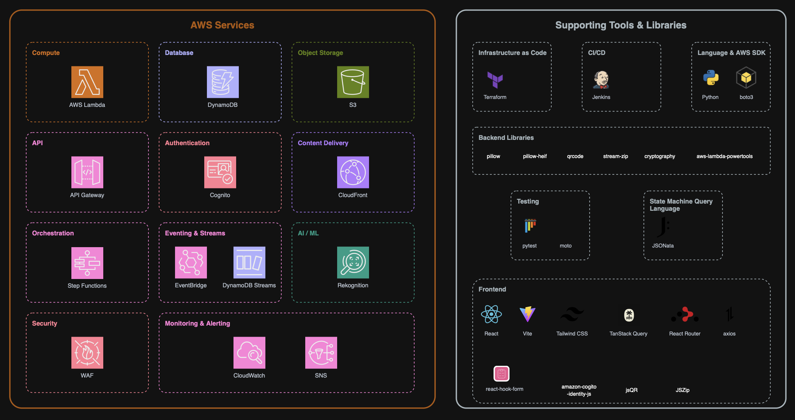
  <br />
  <sub><i>Every AWS service used, grouped by category (compute, database, object storage, API, auth, content delivery, orchestration, eventing, AI/ML, security, monitoring), alongside the supporting tools and libraries that build and run it (Terraform, Jenkins, Python, boto3, pytest, moto, JSONata, and the frontend stack).</i></sub>
</p>

At a glance, here's the shape of a request:

```
        Browser (React SPA on CloudFront)
                    │
             API Gateway (REST, Cognito-authorized)
                    │
     ┌──────────────┼──────────────────────────────┐
     │              │                               │
 10 Lambdas    Step Functions            EventBridge (upload trigger,
 (business     (ingestion pipeline,       daily archive sweep)
  logic)        Distributed Map fan-out)
     │              │
     └──────┬───────┘
            │
   DynamoDB (7 tables)   S3 (1 bucket, 6 prefixes)   Rekognition   CloudFront
```

Nothing runs unless something's actually happening. There are no EC2 instances and no containers idling between requests. A quiet event costs nothing, and a busy upload burst scales out automatically through Lambda concurrency and Step Functions' Distributed Map.

---

## Project structure

```
Glimpses/
├── Backend/                 10 Lambdas, each with the same internal shape:
│   ├── events/                 routeHandler.py -> Handler/ -> Manager/ -> (Converter/) -> DAO/
│   │   ├── src/
│   │   ├── test/unit/       moto-backed unit tests
│   │   ├── test/integration/  moto-backed integration tests
│   │   ├── infra/            this Lambda's own Terraform module
│   │   └── cicd/Jenkinsfile  this Lambda's own CI/CD job
│   ├── ingestion/            same shape, repeated for every Lambda
│   ├── gallery/
│   ├── membership/
│   ├── profile/
│   ├── upload_status/
│   ├── download/
│   ├── db_api/
│   ├── cascadeDelete/
│   └── heic_converter/
├── Frontend/                 React 19 + Vite SPA
├── Infrastructure/
│   ├── imports.tf            the composition root, wires all 17 modules together
│   ├── providers.tf          Terraform/AWS provider config, S3 backend
│   ├── variables.tf          top-level variables (region, alarm email, etc.)
│   ├── cicd/seed.groovy      Jenkins Job DSL seed script
│   └── modules/               shared modules: dynamodb, buckets, alarms, cloudfront,
│                               state_machine, cognito, api_gateway
├── assets/                   README media: marketing, product screenshots,
│                               architecture diagrams, step function graph
└── graphify-out/             pre-built knowledge graph of this entire codebase
```

---

## The Lambdas

| Lambda | What it does |
|---|---|
| **events** | Creates, lists, and updates events; generates QR codes and join codes; computes event stats (photo count, storage used, attendee count); handles archiving and the daily auto-archive sweep |
| **membership** | Handles joining and leaving an event, listing attendees, admitting/denying/ejecting requests, and access-code based joining |
| **profile** | Uploads, replaces, and deletes a selfie; reads and updates basic profile info |
| **upload_status** | Mints presigned S3 upload URLs, and is polled by the frontend to show live upload and processing progress |
| **ingestion** | The engine room. Unpacks uploaded zips, converts, hashes, and thumbnails each photo, indexes faces via Rekognition, and matches attendees to the photos they appear in. Invoked as discrete steps by the Step Functions pipeline below |
| **heic_converter** | Converts iPhone `.HEIC`/`.HEIF` photos to JPEG, called synchronously by `ingestion` mid-pipeline |
| **gallery** | Lists event photos (everything, or just "photos of me"), returns time-limited CloudFront-signed URLs, and handles single or bulk photo deletion |
| **download** | Builds a ZIP of selected photos server-side (bundling belongs with `Downloads`, not `Photos`, so it lives here rather than in `gallery`) |
| **db_api** | The only Lambda allowed to write `Jobs.status`. Owns the status enum, and is called by Step Functions through named actions (`mark_extracting`, `mark_success`, and so on) rather than a literal status string |
| **cascadeDelete** | Tears down everything belonging to a deleted or expired event: S3 photos and thumbnails, `Faces` rows, and the Rekognition face collection. Also handles single-photo and bulk-photo deletion, since it's the Lambda with that IAM reach |

Every Lambda follows the same internal shape: `routeHandler.py` → `Handler/handler.py` → `Manager/manager.py` → an optional `Converter/` for pure computation → `DAO/dao.py` for AWS I/O, each with its own `test/unit` and `test/integration` suite (`moto`-backed) and its own Terraform module under `infra/`.

---

## The database (DynamoDB)

7 tables, all on-demand billing (pay per request, not per provisioned capacity):

| Table | Primary key | GSIs | Notes |
|---|---|---|---|
| **Users** | `userID` | none | |
| **Events** | `eventID` | `organizerID-status-index`, `accessCode-index`, `status-lastUploadAt-index` | Stream enabled (`OLD_IMAGE`), drives the TTL-based cascade delete described below. TTL on `deleteAt` |
| **Jobs** | `jobId` | `eventUploaderKey-startedAt-index` | Tracks each upload's pipeline progress (`CREATED → EXTRACTING → INDEXING → MATCHING → SUCCESS`/`FAILED`) |
| **Photos** | `photoID` | `eventID-uploadedAtFilename-index`, `eventID-contentHash-index` | The content-hash index backs duplicate detection |
| **Faces** | `rekognitionFaceID` | `eventID-photoID-index` | One row per face Rekognition indexed |
| **EventAttendees** | `userID` + `eventID` | `eventID-status-index` | Stream enabled (`NEW_AND_OLD_IMAGES`), drives automatic face-matching for new or rejoining attendees, described below. Rows are never deleted, only status-transitioned (`PENDING`/`ATTENDEE`/`LEFT`/`BLOCKED`) |
| **Downloads** | `downloadId` | none | Tracks server-built ZIP download jobs |

---

## The ingestion pipeline (Step Functions)

Every upload, whether a single photo or an 800 photo zip, runs through the same Step Functions state machine. It's written in **JSONata** (Step Functions' newer, more expressive query language) rather than the older JSONPath dialect.

<p align="center">
  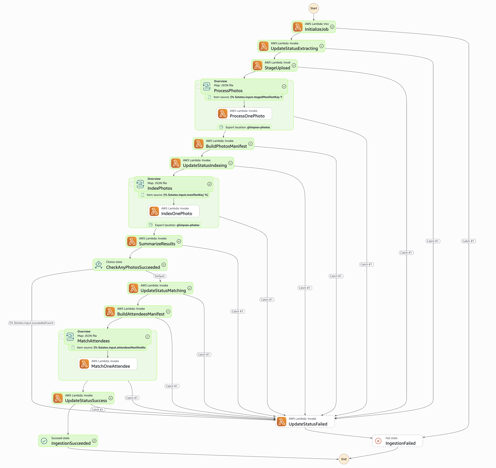
</p>

| Step | What it does |
|---|---|
| **InitializeJob** | Creates the `Jobs` row. `jobId`, `eventID`, and `uploaderID` are parsed straight out of the S3 upload key, since no `Jobs` row exists yet to read them from |
| **UpdateStatusExtracting** | Flips job status to `EXTRACTING`, what the frontend's progress screen reads |
| **StageUpload** | Opens the zip, copies each raw file to S3, and writes a manifest listing every file, without touching image content yet |
| **ProcessPhotos** *(fan-out)* | For every photo, in parallel: sniff the format, hash it for dedup, convert HEIC to JPEG if needed, generate a thumbnail with EXIF rotation applied, save it, and write a `Photos` row. Results are written straight to S3 via `ResultWriter` rather than carried inline through the execution's own state data |
| **BuildPhotosManifest** | Reads those results back from S3, filters down to the photos that actually succeeded, and writes a fresh manifest for the next fan-out |
| **UpdateStatusIndexing** | Status → `INDEXING` |
| **IndexPhotos** *(fan-out)* | For every successfully saved photo, tells Rekognition to learn the faces in it (`IndexFaces`). Also uses `ResultWriter` |
| **SummarizeResults** | Reads the `IndexPhotos` results back from S3 and tallies succeeded and failed counts across the whole batch |
| **CheckAnyPhotosSucceeded** | If literally zero photos made it through, skips straight to failure, since there's nothing left to match attendees against |
| **UpdateStatusMatching** | Status → `MATCHING` |
| **BuildAttendeesManifest** | Writes a manifest of who's currently attending the event, for the next fan-out to read |
| **MatchAttendees** *(fan-out)* | For every attendee, compares their selfie against every indexed face in the event and updates their personal `matchedPhotoIDs` |
| **UpdateStatusSuccess** | Status → `SUCCESS`, with final succeeded and failed counts written to the `Jobs` row |
| **UpdateStatusFailed** | The shared failure path. Anything going wrong anywhere in the pipeline routes here, so a job never gets stuck silently "in progress" forever |

**Why fan out with a Distributed Map, and why `ResultWriter`.** A single Lambda invocation can't process 800 photos within its own timeout, so `ProcessPhotos`, `IndexPhotos`, and `MatchAttendees` each run the same small task once per item, many at once, capped by `MaxConcurrency` (tuned to this AWS account's actual measured service quotas: Rekognition's real TPS limit turned out to be 5, not the published default of 50). For the two largest fan-outs (`ProcessPhotos`, `IndexPhotos`), each item's result is written directly to S3 instead of being carried forward through the state machine's own execution data. Otherwise a few hundred photos' worth of individual results would balloon every subsequent step's state payload, and Step Functions enforces a hard 256KB limit per state.

**Named actions, not raw status strings.** The pipeline never writes a literal `Jobs.status` value itself. It only ever sends a named action (`mark_extracting`, `mark_success`, and so on) to the `db_api` Lambda, which owns the action-to-status mapping and enum enforcement internally. An unrecognized action raises an error rather than silently corrupting the status field.

---

## Triggers and edge cases

**Upload trigger.** An EventBridge rule watches for new objects landing under the S3 uploads prefix and starts the Step Functions execution. There's no polling and no manual kick-off.

**Deleting an event: two different paths, one shared cleanup Lambda.**
- **Manual delete.** The organizer clicks delete, and the `events` Lambda invokes `cascadeDelete` directly and immediately. Permanent, with no waiting.
- **Automatic delete (TTL-driven).** An archived event isn't deleted right away. It gets a `deleteAt` TTL set 30 days out. When that TTL expires, DynamoDB itself deletes the `Events` row, acting as the `dynamodb.amazonaws.com` service principal rather than a human or IAM caller. The `Events` table's stream picks that up and is filtered specifically for `REMOVE` events carrying that service principal, so only genuine TTL expiries trigger `cascadeDelete` this way. A normal application-level delete already went through the direct-invoke path above, so it never double-fires here.

**Archiving versus deleting.** Archiving an event (manually by the organizer, or automatically through a daily EventBridge Scheduler sweep for events inactive 30 or more days) makes it permanently read-only, with no new uploads, and immediately deletes its Rekognition face collection so indexing and matching costs stop right away, while keeping all photos browsable. Only archiving starts the 30-day countdown to eventual deletion, so nothing gets silently deleted without first passing through this read-only stage.

**Matching new attendees: two DynamoDB Stream patterns feeding the same entry point.** The `EventAttendees` table's stream is filtered with two separate patterns, both routed into the same `MatchOneAttendee` matching logic.
1. An existing row transitioning onto `ATTENDEE` (`MODIFY`), for example an organizer approving a pending request, or someone rejoining after leaving.
2. A brand-new row created directly at `ATTENDEE` (`INSERT`), for example a first-time join on an open, no-approval-needed event. This needs its own pattern because an `INSERT` record has no "old" image to compare against, so the first pattern's before/after comparison can't match it.

Without both patterns, someone joining an open event directly would never get matched against the event's existing photos until the next full batch re-match.

---

## The knowledge graph (`graphify`)

<p align="center">
  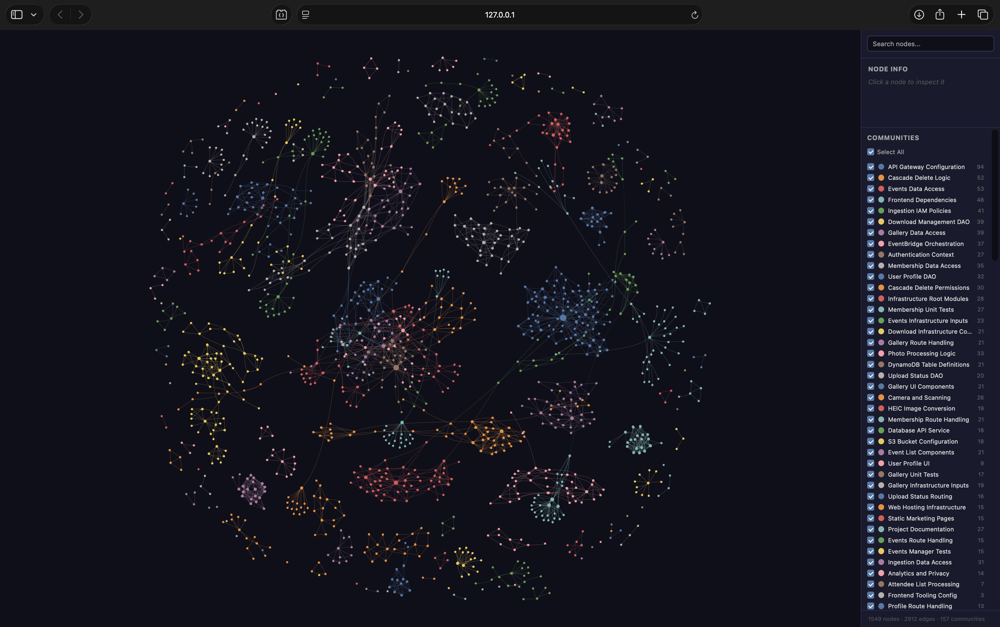
</p>

This repo's `graphify-out/` folder holds a pre-built knowledge graph of the entire codebase: every file, function, and cross-file relationship, with community detection grouping related code together. It's committed to the repo so anyone cloning it gets it immediately, without regenerating it themselves.

If you have the `graphify` CLI installed, you can query it directly instead of grepping through source:

```bash
graphify query "how does the ingestion pipeline trigger face matching"
graphify path "events Lambda" "cascadeDelete Lambda"
graphify explain "EventAttendees stream"
```

`graphify-out/GRAPH_REPORT.md` also has a full written architecture review, for anyone who'd rather read than query.

---

## Cost: built entirely on the AWS Free Tier

Every service here fits comfortably inside AWS's Free Tier at this project's scale: Lambda's million free requests a month, DynamoDB on-demand's free read and write allowance, S3's free storage tier, CloudFront's free data transfer allowance, and Rekognition's free monthly face-processing allowance. Real spend during development stayed effectively at $0, entirely within what the Free Tier already covers. The two things worth watching as usage grows are Rekognition's per-image indexing cost once past the free monthly allowance, and S3 storage once past the free tier's cap. Compute stays essentially free at this scale, since nothing runs when nobody's uploading.

---

## Scaling past the defaults

Two numbers in this project are deliberately set to match a fresh AWS account's real, low default limits. This isn't a ceiling Glimpses needs, it's simply what a new account actually has until you ask AWS to raise it.

- **Lambda's account-wide concurrent execution limit.** New accounts often start around 10 concurrent executions total, shared across every Lambda in the account. `photo_processing_max_concurrency` (Step Functions, `state_machine` module) is tuned down to stay under that.
- **Rekognition's `IndexFaces`/`SearchFacesByImage` TPS quota.** Measured at 5 for this account, against a published default of 50.

For faster ingestion on larger events, request a service quota increase for both from the AWS Service Quotas console (`Lambda` for concurrent executions, `Rekognition` for the two TPS quotas above), then raise the corresponding Terraform variables to match. The pipeline's correctness doesn't depend on these numbers either way: Distributed Map's retry and backoff behavior, along with its tolerated-failure percentage, handle slower throughput gracefully regardless.

---

## Running it yourself

Glimpses is fully open, so nothing stops you from deploying your own copy (see [License](#license)). Setup is genuinely involved, since it's a real multi-service AWS deployment rather than a single-container app. Here's the honest path, distilled from the actual setup log kept while building this.

### 1. AWS account and IAM

Avoid using your AWS root account's keys for Terraform. Create a dedicated IAM user instead.

1. IAM → Users → Create user (for example `your-project-terraform`), with **programmatic access only** and no console login.
2. Attach these AWS-managed policies up front. This project discovered them the slow way, one at a time, whenever the next Terraform module hit a permission wall — attaching them now saves you that trouble:
   `AmazonDynamoDBFullAccess`, `AWSLambda_FullAccess`, `IAMFullAccess`, `AmazonS3FullAccess`, `AmazonAPIGatewayAdministrator`, `AWSStepFunctionsFullAccess`, `AmazonRekognitionFullAccess`, `CloudWatchFullAccess`, `CloudFrontFullAccess`.
3. IAM caps you at **10 managed policies per user**, and you'll reach that ceiling. Bundle the rest (SNS, Cognito, EventBridge Scheduler, plain EventBridge, WAF) into one custom policy instead:
   ```json
   {
     "Version": "2012-10-17",
     "Statement": [
       {
         "Effect": "Allow",
         "Action": ["sns:*", "cognito-idp:*", "cognito-identity:*", "scheduler:*", "events:*", "wafv2:*"],
         "Resource": "*"
       }
     ]
   }
   ```
4. Create an access key for this user (Security credentials → Create access key → CLI use). Store it in a password manager, never in the repo.

### 2. Local AWS CLI profile

```bash
aws configure --profile your-profile-name
# Access Key ID / Secret Access Key from step 1
# Default region: your chosen region (this project used ap-south-1)
# Default output format: json

aws sts get-caller-identity --profile your-profile-name   # sanity check
```

Every local Terraform command needs `AWS_PROFILE` exported first, in every new terminal session, since cross-module apply is deliberately manual and never automated through Jenkins:

```bash
export AWS_PROFILE=your-profile-name
```

### 3. Terraform 1.10 or newer

Native S3 state locking (`use_lockfile = true`) needs this version or newer.

```bash
terraform version
brew upgrade terraform   # if needed
```

### 4. Bootstrap the Terraform state bucket by hand, once

The state bucket has to exist before any `terraform apply`, so Terraform can't create it itself.

```bash
aws s3api create-bucket \
  --bucket your-terraform-state-bucket \
  --region your-region \
  --create-bucket-configuration LocationConstraint=your-region \
  --profile your-profile-name

aws s3api put-bucket-versioning \
  --bucket your-terraform-state-bucket \
  --versioning-configuration Status=Enabled \
  --profile your-profile-name

aws s3api put-public-access-block \
  --bucket your-terraform-state-bucket \
  --public-access-block-configuration BlockPublicAcls=true,IgnorePublicAcls=true,BlockPublicPolicy=true,RestrictPublicBuckets=true \
  --profile your-profile-name
```

Point `Infrastructure/providers.tf`'s `backend "s3" {}` block at this bucket. Backend config values must be literal strings, since Terraform reads them before any variables resolve.

### 5. Check your account's real Rekognition quota

Don't assume the published default of 50 TPS. New or lightly-used AWS accounts commonly start much lower; this project's actual quota was **5**, for both `IndexFaces` and `SearchFacesByImage`.

```bash
aws service-quotas list-service-quotas --service-code rekognition \
  --query "Quotas[?contains(QuotaName, 'IndexFaces') || contains(QuotaName, 'SearchFaces')]"
```

Set `rekognition_index_max_concurrency` and `rekognition_search_max_concurrency` (in `Infrastructure/modules/state_machine`) to whatever your account actually has. This only affects throughput, not correctness.

### 6. Variables to change for your own deployment

| Variable | File | What to set it to |
|---|---|---|
| `alarm_email` | `Infrastructure/variables.tf` | Your own email address for CloudWatch alarm notifications (default placeholder: `johndoe@gmail.com`) |
| `aws_region` | `Infrastructure/variables.tf` | Your chosen AWS region (default `ap-south-1`) |
| `repoUrl` / `credentialsId` | `Infrastructure/cicd/seed.groovy` | Your own GitHub repo URL and Jenkins credentials ID, if using the Jenkins seed job |
| Terraform backend bucket name | `Infrastructure/providers.tf` | The state bucket created in step 4 |

### 7. Deploy

```bash
export AWS_PROFILE=your-profile-name
cd Infrastructure
terraform init
```

Apply the modules in dependency order (this project's actual order, run either by hand or through the 17 Jenkins jobs described below):

```
dynamodb -> buckets -> alarms -> cloudfront
  -> heic_converter -> db_api -> download -> ingestion -> profile
  -> upload_status -> events -> membership -> gallery -> cascade_delete
  -> state_machine -> cognito -> api_gateway   (last, since it needs every other module's output)
```

```bash
terraform apply -target=module.dynamodb
terraform apply -target=module.buckets
# and so on, in the order above
```

Frontend deploy is separate; see `Frontend/` once you're building it out for your own use.

---

## CI/CD (Jenkins)

This project used a local, Homebrew-installed Jenkins rather than an AWS-hosted CI service: one job per Terraform module, 17 jobs in total, each with its own `cicd/Jenkinsfile` sitting right next to the code it builds and deploys. It's genuinely just a laptop running Jenkins in the background. There's nothing exotic about the setup, but it saved an enormous amount of time compared to applying every module by hand on every change.

Rather than clicking "New Item" 17 times, there's a seed job (`Infrastructure/cicd/seed.groovy`, a Jenkins Job DSL script) that reads a plain-text list of Jenkinsfile paths and creates a pipeline job for each one, pointed at this GitHub repo. To use it:

1. Install the **Job DSL** plugin in Jenkins.
2. Create one Jenkins job named `glimpses-seed` running that Groovy script.
3. Give it a `jenkinsfiles.txt` in its workspace, one Jenkinsfile path per line (for example `Backend/events/cicd/Jenkinsfile`), one line per module, 17 total.
4. Run it once. It creates, or updates, every other job automatically.

Each per-Lambda `cicd/Jenkinsfile` builds and deploys just that one Lambda; each infra module's Jenkinsfile runs `terraform apply -target=module.X` for just that module. Nothing is bundled together. Every module has its own job on purpose, so a failure or change in one stays isolated and easy to reason about.

**If you self-host Jenkins for this:** it runs as a background service with a minimal `PATH`, so build steps that call bare `pip` or `python3` may fail even though they work fine in your interactive terminal. Use `python3 -m pip install ...` rather than bare `pip install ...` in build steps to avoid this.

---

## License

Freely licensed, with no restrictions. Use this however you'd like: as a reference, as a starting point for your own event photo app, or deployed as-is for your own events. No attribution required, though it's always appreciated.
